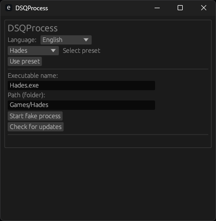

# 🌀 DSQProcess (Discord Quest Process)

  <a href="/README_es.md">Español</a>

> ⚙️ Simulates the execution of games to complete Discord missions without installing the actual games.

DSQProcess is a lightweight, safe, and customizable tool designed to help users with low-end PCs or limited storage complete **Discord quests** that require playing specific games for 15 minutes or more.

---

## 🌟 Features

- 🖥️ Simple and professional graphical interface (based on egui).
- 🌐 Multilanguage support (Spanish and English).
- 🔄 Auto-updates from GitHub Releases.
- 📁 Customizable presets with realistic folder structure.
- 💾 Persistent settings (language, selected game, etc.).
- 🧱 Secondary executable (`dsqchild`) simulates the game process for 15 minutes or until manually closed.
- 🚫 No console: everything runs from the graphical interface.

---

## 📷 Screenshots

---

## 🚀 How to use

1. Run `DSQProcess`.
2. Select a preset or manually define the executable name and its path.
3. Click "Start Process".
4. The program will copy `dsqchild` using the selected game name and run it for 15 minutes (or until manually stopped).
5. Discord will detect the game as running, allowing you to complete the quest.

---

## 📦 Downloads

> ⚠️ This tool is intended for educational or personal use only. It is not affiliated with or endorsed by Discord Inc.

- The latest versions are available in the [Releases](https://github.com/Nicolhetti/DSQProcess/releases) section.

---

## 🌍 Available Languages

- 🇪🇸 Spanish  
- 🇺🇸 English

---

## 🔧 Requirements

- Windows 7/10/11 (partial support on Linux via Wine)
- Discord installed and running

---

## 👨‍💻 Author

Developed by [@Nicolhetti](https://github.com/Nicolhetti) <!-- And a little bit of Copilot, sorry Pro Devs 💔 -->

---

## ⚠️ Disclaimer

This project does not promote malicious or fraudulent use.  
Discord Inc. may change its detection methods or policies at any time.

---
