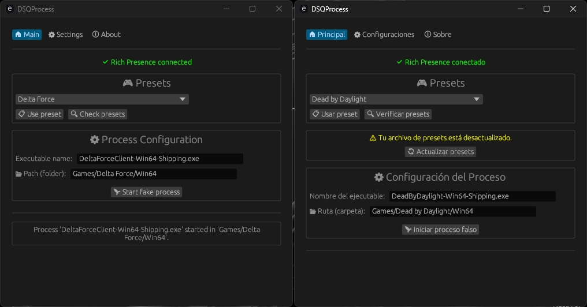
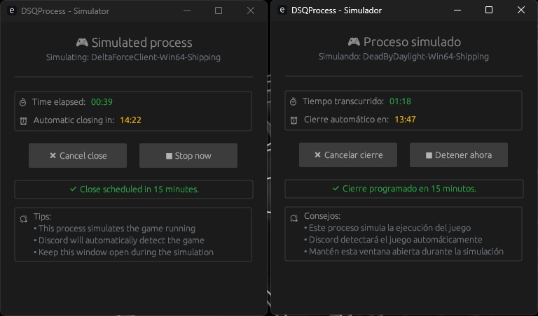

# 🌀 DSQProcess (Discord Quest Process)

  <a href="/README_es.md">Español</a>

> ⚙️ Simulates the execution of games to complete Discord quests without installing the actual games.

**DSQProcess** is a lightweight, safe, and customizable tool designed for users with low-end PCs or limited disk space who want to complete **Discord quests** that require playing specific games for 15 minutes or more.

---

## 🌟 Features

- 🖥️ **Modern Interface**: Simple and intuitive graphical interface powered by `egui`.
- 🧭 **Organized Tabs**: Clean UI divided into **Main**, **Settings**, and **About** sections.
- 🕵️‍♂️ **Discord Detection**: Automatically detects if Discord is running (Normal, Canary, PTB).
- 🔘 **Quick Discord Launch**: Start Discord directly from the app if it's closed.
- 📁 **Game Presets**: Customizable game presets stored locally with 30+ popular games included.
- 🔄 **Auto-Update Presets**: One-click update for presets from the GitHub repository.
- 🔍 **Manual Preset Check**: Verify preset updates without restarting the application.
- 🎮 **Discord Rich Presence**: Show your current simulated game on Discord (optional).
- 🌐 **Multi-Language**: Full support for Spanish and English.
- 💾 **Settings Memory**: Remembers your preferences between sessions.
- 📦 **Dual Executable**: Includes a secondary process (`dsqchild`) for game simulation.
- ⚙️ **No Terminal Required**: Everything runs within the graphical interface.

---

## 📷 Screenshots

---

## 🚀 How to Use

1. **Launch DSQProcess** and navigate to the **Main** tab.
2. **Select a preset** from the dropdown or manually enter the executable name and path.
3. **Click "Start Process"** to begin simulation.
4. The app will copy and rename `dsqchild` using the game name and run it.
5. **Discord will detect** the fake game process, allowing you to complete the quest.
6. **Rich Presence** (if enabled) will show the simulated game on your Discord profile.

---

## 🎮 Rich Presence

- **Displays**: "Playing [Game Name]" on your Discord profile
- **Shows**: Time elapsed since DSQProcess started
- **Toggleable**: Can be enabled/disabled in Settings (enabled by default)
- **Smart Detection**: Uses proper game names instead of executable names

---

## 🔄 Preset Management

- **30+ Games Included**: Popular games like Fortnite, Valorant, Apex Legends, and more.
- **Manual Updates**: Check for preset updates without restarting the app.
- **Auto-Notification**: DSQProcess notifies you when presets are outdated.
- **Easy Editing**: Manually edit `presets.json` to add custom games.

---

## 📦 Downloads

> ⚠️ This tool is for **educational/personal use only** and is **not affiliated with Discord Inc.**

- Download the latest version from the [Releases](https://github.com/Nicolhetti/DSQProcess/releases) page.

---

## 🌍 Available Languages

- 🇪🇸 **Spanish** (Español)
- 🇺🇸 **English** 

---

## 🔧 Requirements

- **Windows** 7 / 10 / 11
- **Discord** installed and running
- **Internet connection** (for preset updates and Rich Presence)

---

## 🆕 What's New in v0.4.0

- ✨ **Discord Rich Presence integration**
- 🔍 **Manual preset verification**
- 🎨 **Improved UI with centered elements and better organization**
- 🎮 **Smart game name detection for Rich Presence**
- 🚀 **Performance improvements**

---

## 👨‍💻 Author

Developed by [@Nicolhetti](https://github.com/Nicolhetti)  
<!-- *With a little help from Claude Sonnet 💻✨* -->

---

## ⚠️ Disclaimer

This project does **not** encourage any kind of fraud or abuse.  
Discord Inc. may update their detection mechanisms or policies at any time. Use responsibly.

---

## 📝 License

This project is licensed under the MIT License - see the [LICENSE](LICENSE) file for details.