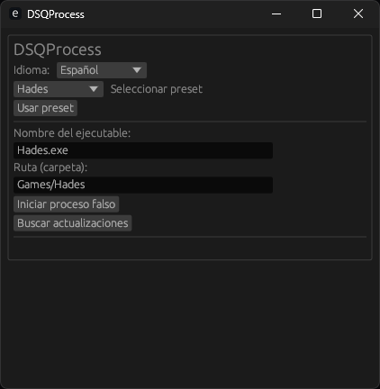

# 🌀 DSQProcess (Discord Quest Process)

  <a href="/README.md">English</a>

> ⚙️ Simula la ejecución de juegos para cumplir misiones de Discord sin tener que instalar los juegos reales.

DSQProcess es una herramienta ligera, segura y personalizable, diseñada para ayudar a usuarios con PCs de bajos recursos o sin espacio/disco suficiente a completar **misiones de Discord** que requieren jugar ciertos juegos durante 15 minutos o más.

---

## 🌟 Características

- 🖥️ Interfaz gráfica simple y profesional (basado en egui).
- 🌐 Multilenguaje (Español e Inglés).
- 🔄 Actualizaciones automáticas desde GitHub Releases.
- 📁 Presets personalizables con estructura de carpetas.
- 💾 Configuración persistente (idioma, selección de juego, etc).
- 🧱 Ejecutable secundario (`dsqchild`) que simula el proceso por 15 minutos o hasta cerrarse manualmente.
- 🚫 Sin consola: todo ocurre desde la interfaz gráfica.

---

## 📷 Capturas

---

## 🚀 Cómo usar

1. Ejecuta `DSQProcess`.
2. Selecciona un preset o define manualmente el nombre del ejecutable y su ruta.
3. Presiona "Iniciar proceso".
4. El programa copiará `dsqchild` con el nombre del juego y lo ejecutará por 15 minutos (o hasta que lo cierres manualmente).
5. Discord detectará que el juego está en ejecución, permitiéndote cumplir la misión.

---

## 📦 Descargas

> ⚠️ Solo utiliza esta herramienta para propósitos educativos o personales. No está afiliada ni respaldada por Discord Inc.

- Las últimas versiones se encuentran en la sección [Releases](https://github.com/Nicolhetti/DSQProcess/releases)

---

## 🌍 Idiomas disponibles

- 🇪🇸 Español
- 🇺🇸 English

---

## 🔧 Requisitos

- Windows 7/10/11 (soporte parcial en Linux mediante Wine)
- Discord instalado y en ejecución

---

## 👨‍💻 Autor

Desarrollado por [@Nicolhetti](https://github.com/Nicolhetti) <!-- Y un poquito de Copilot, lo siento Pro Devs 💔 -->

---

## ⚠️ Descargo de responsabilidad

Este proyecto no promueve el uso malicioso o fraudulento.  
Discord Inc. podría modificar sus condiciones o detección en cualquier momento.

---
