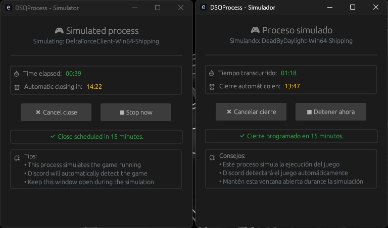

# 🌀 DSQProcess (Discord Quest Process)

  <a href="/README.md">English</a>

> ⚙️ Simula la ejecución de juegos para completar misiones de Discord sin instalar los juegos reales.

**DSQProcess** es una herramienta ligera, segura y personalizable diseñada para usuarios con PCs de bajos recursos o espacio limitado en disco que desean completar **misiones de Discord** que requieren jugar juegos específicos durante 15 minutos o más.

---

## 🌟 Características

- 🖥️ **Interfaz Moderna**: Interfaz gráfica simple e intuitiva desarrollada con `egui`.
- 🧭 **Pestañas Organizadas**: UI limpia dividida en secciones **Principal**, **Configuraciones** y **Sobre**.
- 🕵️‍♂️ **Detección de Discord**: Detecta automáticamente si Discord está ejecutándose (Normal, Canary, PTB).
- 🔘 **Inicio Rápido de Discord**: Inicia Discord directamente desde la aplicación si está cerrado.
- 📁 **Presets de Juegos**: Presets personalizables almacenados localmente con más de 30 juegos populares incluidos.
- 🔄 **Auto-Actualización de Presets**: Actualización con un clic desde el repositorio de GitHub.
- 🔍 **Verificación Manual de Presets**: Verifica actualizaciones sin reiniciar la aplicación.
- 🎮 **Discord Rich Presence**: Muestra tu juego simulado actual en Discord (opcional).
- 🌐 **Multi-Idioma**: Soporte completo para español e inglés.
- 💾 **Memoria de Configuraciones**: Recuerda tus preferencias entre sesiones.
- 📦 **Ejecutable Dual**: Incluye un proceso secundario (`dsqchild`) para simulación de juegos.
- ⚙️ **Sin Terminal**: Todo funciona dentro de la interfaz gráfica.

---

## 📷 Capturas de Pantalla

---

## 🚀 Cómo Usar

1. **Ejecuta DSQProcess** y ve a la pestaña **Principal**.
2. **Selecciona un preset** del menú desplegable o ingresa manualmente el nombre del ejecutable y la ruta.
3. **Haz clic en "Iniciar Proceso"** para comenzar la simulación.
4. La aplicación copiará y renombrará `dsqchild` usando el nombre del juego y lo ejecutará.
5. **Discord detectará** el proceso falso del juego, permitiéndote completar la misión.
6. **Rich Presence** (si está habilitado) mostrará el juego simulado en tu perfil de Discord.

---

## 🎮 Rich Presence

- **Muestra**: "Jugando [Nombre del Juego]" en tu perfil de Discord
- **Indica**: Tiempo transcurrido desde que se inició DSQProcess
- **Configurable**: Se puede activar/desactivar en Configuraciones (activado por defecto)
- **Detección Inteligente**: Usa nombres propios de juegos en lugar de nombres de ejecutables

---

## 🔄 Gestión de Presets

- **Más de 30 Juegos Incluidos**: Juegos populares como Fortnite, Valorant, Apex Legends, y más.
- **Actualizaciones Manuales**: Verifica actualizaciones de presets sin reiniciar la aplicación.
- **Notificación Automática**: DSQProcess te notifica cuando los presets están desactualizados.
- **Edición Fácil**: Edita manualmente `presets.json` para agregar juegos personalizados.

---

## 📦 Descargas

> ⚠️ Esta herramienta es para **uso educativo/personal únicamente** y **no está afiliada con Discord Inc.**

- Descarga la última versión desde la página de [Releases](https://github.com/Nicolhetti/DSQProcess/releases).

---

## 🌍 Idiomas Disponibles

- 🇪🇸 **Español**
- 🇺🇸 **English** (Inglés)

---

## 🔧 Requisitos

- **Windows** 7 / 10 / 11
- **Discord** instalado y ejecutándose
- **Conexión a internet** (para actualizaciones de presets y Rich Presence)

---

## 🆕 Novedades en v0.4.0

- ✨ **Integración con Discord Rich Presence**
- 🔍 **Verificación manual de presets**
- 🎨 **UI mejorada con elementos centrados y mejor organización**
- 🎮 **Detección inteligente de nombres de juegos para Rich Presence**
- 🚀 **Mejoras de rendimiento**

---

## 👨‍💻 Autor

Desarrollado por [@Nicolhetti](https://github.com/Nicolhetti)  
<!-- *Con un poco de ayuda de Claude Sonnet 💻✨* -->

---

## ⚠️ Descargo de Responsabilidad

Este proyecto **no** fomenta ningún tipo de fraude o abuso.  
Discord Inc. puede actualizar sus mecanismos de detección o políticas en cualquier momento. Úsalo responsablemente.

---

## 📝 Licencia

Este proyecto está licenciado bajo la Licencia MIT - consulta el archivo [LICENSE](LICENSE) para más detalles.