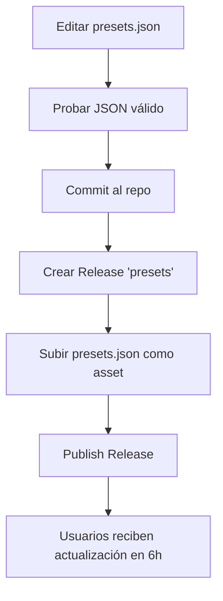

# 📋 Guía para Actualizar Presets Oficiales

## 🎯 Propósito

Esta guía explica cómo publicar actualizaciones de presets oficiales usando GitHub Releases para evitar el error **429 Too Many Requests** que ocurre al usar archivos raw.

---

## 🔄 Nuevo Sistema de Actualización

### Ventajas:
- ✅ **Sin límites de rate**: Usa GitHub Releases API en lugar de raw files
- ✅ **Versionado**: Control de versiones para presets
- ✅ **Cache inteligente**: Verifica actualizaciones cada 6 horas
- ✅ **Integridad**: Validación mediante hash
- ✅ **Timeout configurable**: No bloquea la aplicación

---

## 📝 Cómo Publicar Nuevos Presets

### Paso 1: Actualizar `presets.json`

Edita el archivo `presets.json` en el repositorio con los nuevos juegos:

```json
[
    {
        "name": "Nuevo Juego",
        "executable": "NuevoJuego.exe",
        "path": "NuevoJuego/Win64"
    }
]
```

### Paso 2: Crear Release de Presets

1. Ve a **GitHub → Releases → Draft a new release**
2. Configura el release:
   - **Tag**: `presets` (⚠️ **IMPORTANTE**: Siempre usar este tag exacto)
   - **Release title**: `Presets Update - v1.1.0` (o la versión correspondiente)
   - **Description**:
     ```markdown
     ## 🎮 Presets Update v1.1.0

     ### ✨ Nuevos Juegos Agregados:
     - Nuevo Juego 1
     - Nuevo Juego 2

     ### 🔧 Juegos Actualizados:
     - Juego X: Actualizada ruta del ejecutable

     ### 🗑️ Juegos Removidos:
     - Juego Y: Ya no disponible
     ```

3. **Subir `presets.json`** como asset del release:
   - Click en **Attach binaries by dropping them here or selecting them**
   - Selecciona tu archivo `presets.json` actualizado

4. ⚠️ **Marcar como "Latest release"** para que DSQProcess lo detecte

5. Click en **Publish release**

---

## 🔧 Sistema de Versionado

### Tags Importantes:

- **`presets`**: Tag único para releases de presets (no cambiar)
- **Versión**: Usar semantic versioning en el título (v1.0.0, v1.1.0, v2.0.0)

### Cuándo Incrementar la Versión:

- **v1.0.X** (Patch): Correcciones menores (typos, rutas incorrectas)
- **v1.X.0** (Minor): Agregar nuevos juegos
- **vX.0.0** (Major): Reestructuración completa de presets

---

## 📊 Metadata Local

DSQProcess guarda metadata en `presets_metadata.json`:

```json
{
  "version": "1.1.0",
  "last_check": 1735000000,
  "hash": "a1b2c3d4e5f6"
}
```

- **version**: Última versión conocida
- **last_check**: Timestamp de última verificación (cache 6h)
- **hash**: Hash del contenido para validación

---

## 🧪 Probar Localmente

Antes de publicar, prueba que el JSON es válido:

```bash
# Validar JSON
cat presets.json | jq .

# O usar un validador online
# https://jsonlint.com/
```

---

## ⚠️ Notas Importantes

1. **Tag `presets` es permanente**: Cada nueva versión sobrescribe el release anterior
2. **Siempre incluir el archivo `presets.json`** como asset
3. **No borrar releases antiguos** hasta asegurar que usuarios actualizaron
4. **Cache de 6 horas**: Los usuarios no verán actualizaciones inmediatamente
5. **Fallback local**: Si falla la descarga, se usa la versión local

---

## 🔄 Workflow Recomendado



---

## 🆘 Troubleshooting

### Error: "404 Release not found"
- Verifica que el tag sea exactamente `presets`
- Asegúrate de que el release esté publicado (no draft)

### Error: "presets.json not found in release"
- Verifica que subiste el archivo como asset
- El nombre debe ser exactamente `presets.json`

### Usuarios reportan presets antiguos
- El cache es de 6 horas, pedir que usen "Check presets" manualmente
- O que esperen al auto-check

---

## 📧 Contacto

Para dudas sobre el sistema de presets: [@Nicolhetti](https://github.com/Nicolhetti)
